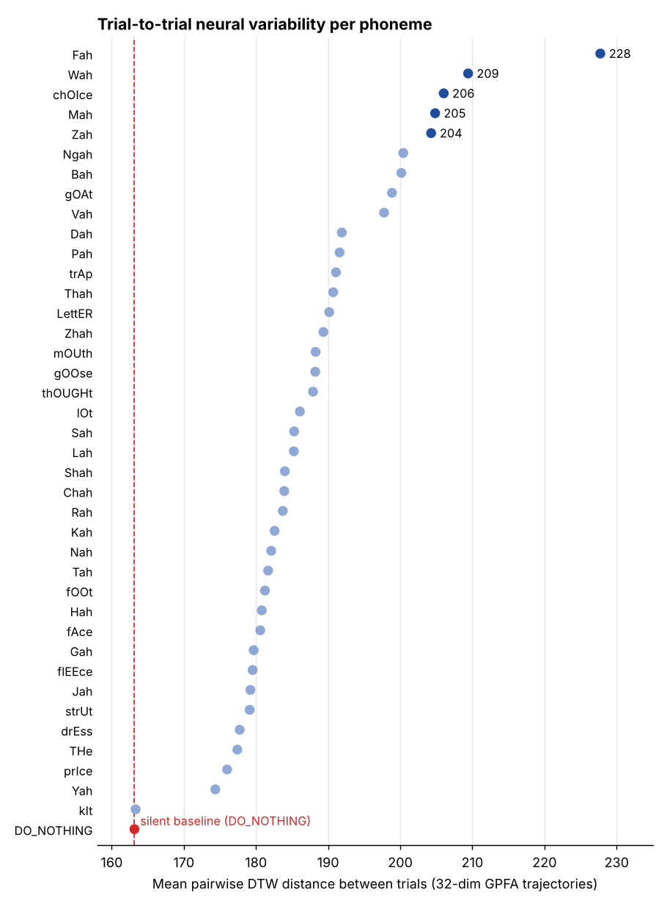
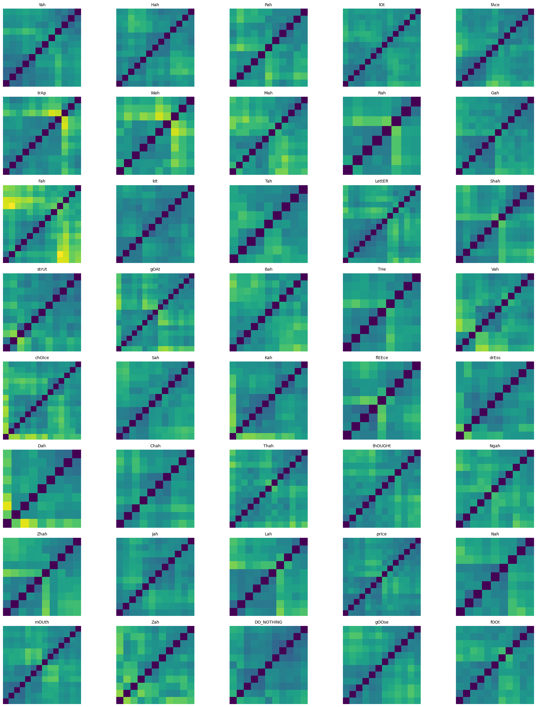
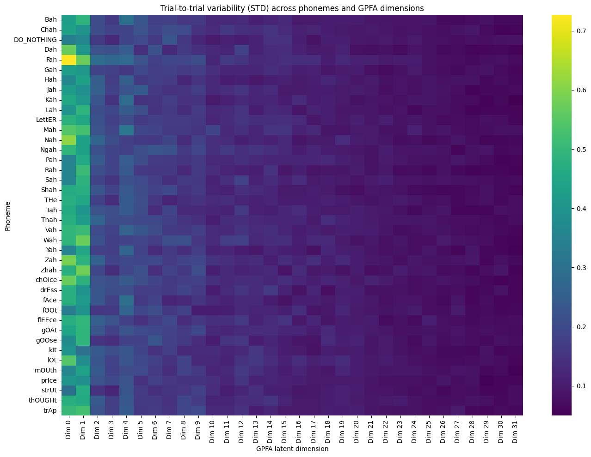
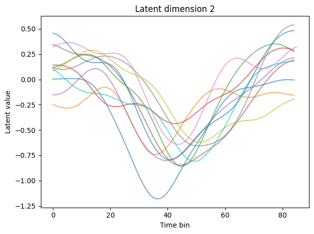

# Phoneme Variability in Speech BCI Neural Dynamics

**🥈 2nd Place — Best Engineering** · Brain–Computer Interface Hackathon, UC San Diego (Data Science & Neuroscience) × University of Michigan (Biomedical Engineering), Fall 2025

[](https://colab.research.google.com/github/YOUR-USERNAME/bci-phoneme-variability/blob/main/phoneme_variability.ipynb)


> When someone with paralysis attempts the same sound over and over, how consistent is the activity in their motor cortex, and which sounds are hardest for a speech decoder to pin down?

Intracortical speech brain–computer interfaces (BCIs) turn neural activity into text. They mostly fail on phonemes whose neural signature changes from one attempt to the next. This project measures that **trial-to-trial variability for each phoneme**. It uses low-dimensional neural trajectories from Gaussian Process Factor Analysis (GPFA) and multidimensional Dynamic Time Warping (DTW) to find which phonemes are least consistent, which latent dimensions carry the variability, and how much of it is just differences in speaking speed.

## Highlights

- **A per-phoneme map of neural consistency** across 39 English phonemes plus a silent control, built from 460 single trials of intracortical recordings (participant T12, [Willett et al., *Nature* 2023](https://www.nature.com/articles/s41586-023-06377-x)).
- **`Fah` (/f/) is the least consistent phoneme.** Its mean pairwise DTW distance is ≈228, about **40% above the silent `DO_NOTHING` baseline** (≈163). It's followed by `Wah`, `chOIce`, `Mah` and `Zah`. `kIt` is the most consistent phoneme, essentially at baseline.
- **Two independent metrics agree.** `Fah` also has the largest trial-to-trial spread in the leading GPFA dimension.
- **Variability is low-dimensional.** It is concentrated in the first few of the 32 GPFA dimensions and decays quickly after that.
- **Outlier trials stand out.** Clustering the DTW matrices exposes individual atypical attempts, a quick way to screen decoder training data.

<p align="center">
  
</p>

## Method

```
spiking activity ──► GPFA latent trajectories ──► pairwise multidimensional DTW ──► per-phoneme similarity matrices
   (per trial)        (32 dims × T time bins)       (all trials of a phoneme)          + hierarchical clustering
                                     │
                                     └──► DTW alignment to medoid trial ──► variability maps (phoneme × dimension),
                                                                              timing vs. shape decomposition
```

1. **GPFA latent trajectories.** Each trial's population spiking is summarized as a smooth 32-dimensional latent trajectory (Yu et al., 2009). Trials differ in length (number of time bins).
2. **Multidimensional DTW.** For each phoneme, every pair of trials is compared with DTW across all 32 dimensions at once (Euclidean local cost). DTW tolerates differences in speaking speed, so the distance reflects differences in the trajectory itself, not misalignment.
3. **Hierarchical clustering.** Each trial × trial distance matrix is reordered with average linkage, so groups of similar trials form blocks and outliers show up as bright rows.
4. **Medoid alignment.** Within each latent dimension, every trial is warped onto the *DTW medoid* (the trial most similar to all the others), so all trials share one time axis.
5. **Variability maps.** Across-trial standard deviation for each phoneme and dimension, before and after alignment. The ratio between the two shows how much variability is **timing** versus **shape**.

| Trial × trial DTW distance matrices (clustered, shared colour scale) | Variability by phoneme × GPFA dimension |
|:---:|:---:|
|  |  |

Repeated attempts of the same phoneme (`Bah`, latent dimension 2) follow the same overall shape, but the main dip happens at different times. That timing difference is what DTW alignment removes:

<p align="center"></p>

## Why it matters for decoders

- **Where to focus data collection.** High-variability phonemes are the most likely to be confused. They would benefit most from extra training trials or targeted augmentation.
- **Compact decoder inputs.** Because variability sits in a few leading dimensions, low-dimensional latent inputs and dimension-specific regularization make sense.
- **Timing versus shape.** Decoders that tolerate time warping (such as RNN/CTC models) can absorb differences in speaking rate, but not differences in trajectory shape. Separating the two shows which kind of variability a decoder still has to handle.

## Repository

```
├── phoneme_variability.ipynb   # full, narrated analysis
├── figures/                    # key figures used above
├── requirements.txt
└── README.md
```

## Running it

The notebook downloads the public hackathon data (GPFA factors and cue labels, about 2 minutes) on first run. No Google Drive or local data is needed.

- **Colab:** click the badge above, then *Runtime → Run all*.
- **Locally:**
  ```bash
  pip install -r requirements.txt
  jupyter notebook phoneme_variability.ipynb
  ```

## Team

Team **Jawdroppers**: Tejal Malpeddi, *[add teammates]*

## References

- Willett, F. R. *et al.* A high-performance speech neuroprosthesis. *Nature* **620**, 1031–1036 (2023).
- Yu, B. M. *et al.* Gaussian-process factor analysis for low-dimensional single-trial analysis of neural population activity. *J. Neurophysiol.* **102**, 614–635 (2009).
- Giorgino, T. Computing and visualizing dynamic time warping alignments in R: the dtw package. *J. Stat. Softw.* **31**(7) (2009).
